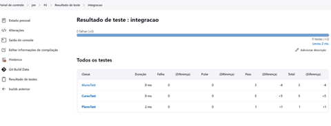
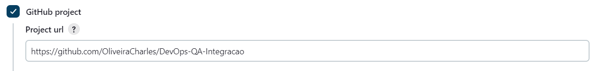
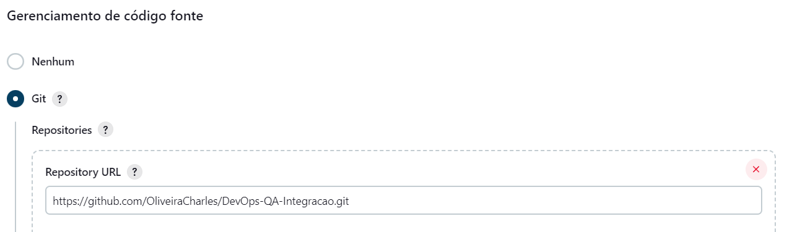
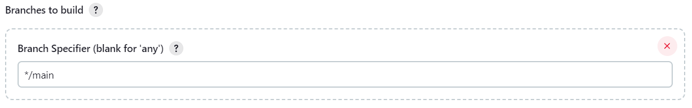
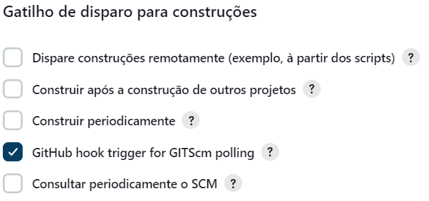
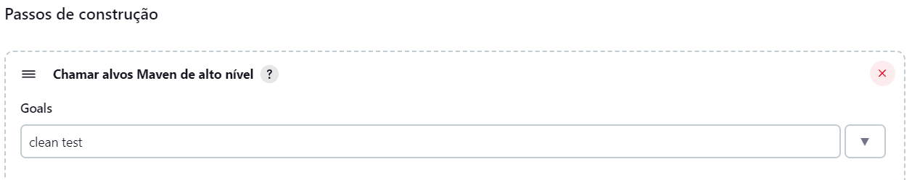
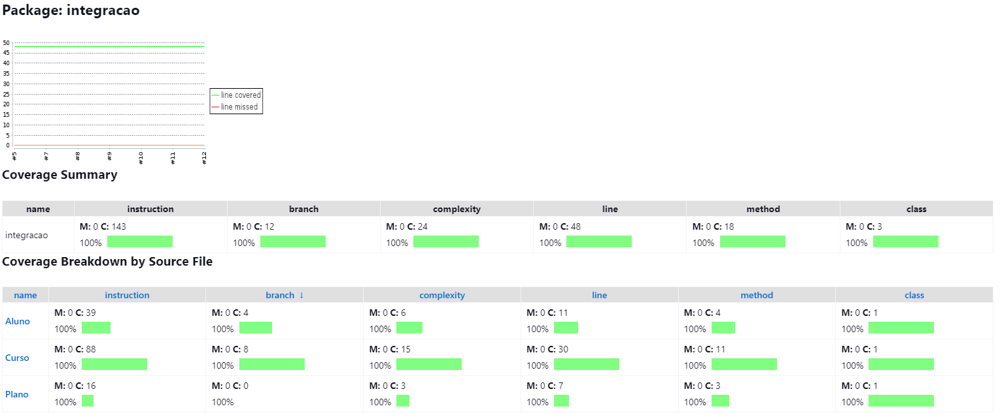
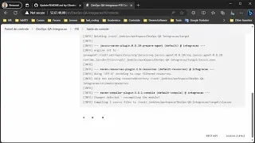

# DevOps & QA - Integração

Automação de testes com Jenkins de uma aplicação em Java, utilizando  WebHooks do GitHub, Maven como gerenciador de pacotes e JaCoCo como gerenciador de relatórios.

## KeyWords

Jenkins, Java, WebHooks, GitHub, Maven, JaCoCo

## Running Jenkins with Docker



Running the below command will start a Jenkins process in the <http://localhost:8080>

```bash
docker-compose up -d
```

## Running tests with Jenkins.war

1. Baixe o arquivo [Jenkins WAR](https://www.jenkins.io/download) mais recente para um diretório em sua máquina `C:/DEV/Tools/Jenkins`.

2. Abra uma janela de terminal/prompt de comando para o diretório `C:/DEV/Tools/Jenkins`

    ```sh
    cd C:/DEV/Tools/Jenkins
    ```

3. Execute o comando ``java -jar jenkins.war``

    ```ps1
    java -jar jenkins.war --httpPort=8180
    ```

    > Note: Caso a versão do java instalado seja muito recente o seguinte erro pode ocorrer

    ```cmd
    Running with Java 20 from C:\DEV\TOOLS\JAVA\jdk-20.0.2, which is not yet fully supported.
    Run the command again with the --enable-future-java flag to enable preview support for uture Java versions.
    Supported Java versions are: [11, 17]
    See <https://jenkins.io/redirect/java-support/> for more information.
    ```

    Para solucionar adicione a flag --enable-future-java ao comando:

    ```ps1
    java -jar jenkins.war --httpPort=8180 --enable-future-java
    ```

4. Navegue até <http://localhost:8180> e aguarde até que a página **Unlock Jenkins** seja exibida.

5. Debloqueie o jenkins utilizando a **senha exibida no console**
    >Também pode ser encontrada em: `C:/Users/<Seu Usuário>/.jenkins/secrets/initialAdminPassword`

6. Instale as extensões necessárias
    > Info: Se você não tiver certeza de quais plugins você precisa, escolha **Instalar plugins sugeridos** . Você pode instalar (ou remover) plug-ins adicionais do Jenkins em um momento posterior através da página [Manage Jenkins](https://www.jenkins.io/doc/book/managing) > [Plugins](https://www.jenkins.io/doc/book/managing/plugins/) no Jenkins.

    O assistente de configuração mostra a progressão do Jenkins que está sendo configurado e seu escolhido conjunto de plugins Jenkins sendo instalados. Esse processo pode levar alguns minutos.

7. Crie um novo administrador do sistema

8. Criar um novo trabalho (Job)

    - Dê um nome ao novo trabalho
    - Selecione a opção: Construir um projeto de software de **estilo livre**.
    - Clique em **Tudo certo**

9. Configure o novo trabalho
    - Descrição:
    - GitHub project
        
    - Gerenciamento de código fonte
        
        - Branches to build
            
    - Gatilho de disparo para construções
        
    - Passos de construção
        

    - Clique em **Salvar**

## Coverage Tests



## Docs

- [Template](https://facens-my.sharepoint.com/personal/charles_oliveira_facens_br/Documents/DevOps%20eQA/Template_ATDD_Com_Exemplo_v2022.xlsx?web=1)

- [Relatório](https://facens-my.sharepoint.com/personal/charles_oliveira_facens_br/Documents/DevOps%20eQA/Tarefa%203%20-%20Desenvolvimento%20com%20ATDD.docx?web=1)

- [Vídeo](https://www.youtube.com/watch?v=m6VtSrxWU0Q)

    |[Automação de testes com Jenkins](https://www.youtube.com/watch?v=m6VtSrxWU0Q)|
    |:-|
    |[](https://www.youtube.com/watch?v=m6VtSrxWU0Q)|

## Referencias

- GitHub - [Criar webhooks](https://docs.github.com/pt/webhooks/using-webhooks/creating-webhooks)
- Jenkins - [Gatilho de WebHooks do GitHub para sondagem GITScm](https://plugins.jenkins.io/github/)
- Jenkins - [Installing war file](https://www.jenkins.io/doc/book/installing/war-file/)
- Jenkins - [User Handbook](https://www.jenkins.io/user-handbook.pdf)
